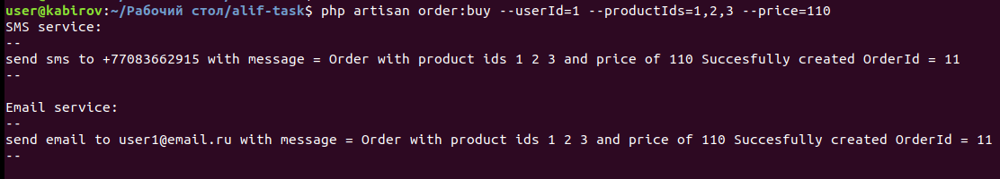

## Event-Buy

Event buy command, using laravel framework and postgreSql database.

### Installation steps

- cp .env.example .env
- composer install
- install postgreSQL if you don't have
- create DATABASE alif
- Create user 'dev' with password 'start' and privileges
- php artisan migrate
- php artisan serve

### Postman requests to get data from database:

- GET Products: http://localhost:8000/api/products
- GET Users: http://localhost:8000/api/users
- GET Orders: http://localhost:8000/api/orders

### Usage

Run command below if you want to create order, you should give client id, productIds which you want to buy and total price of your order, you can get ids and prices from Database by above links with the Postman.
- php artisan order:buy {--userId=} {--productIds=} {--price=}

#### Example
- php artisan order:buy --userId=1 --productIds=1,2,3 --price=110

